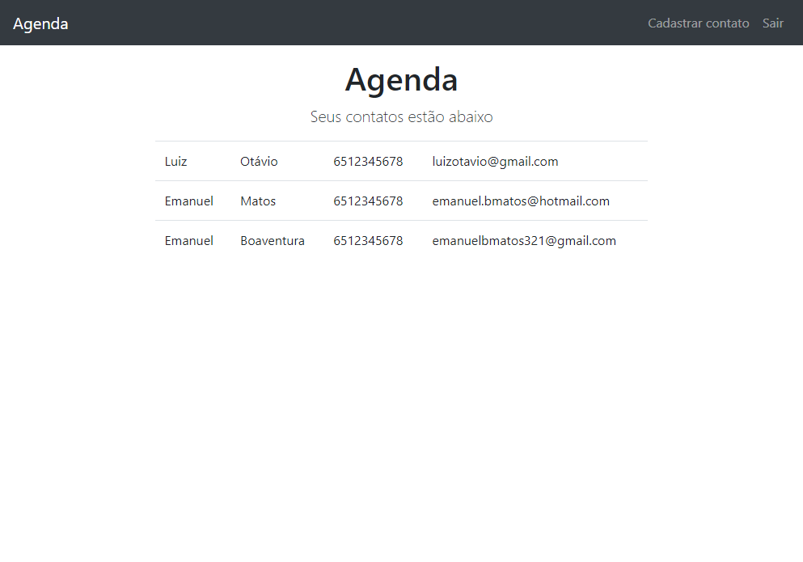

# Agenda Project

> Project built from Luiz Otávio Miranda's Udemy course

A Agenda Project where you can make a list of contacts who will be saved on a MongoDB server. But you will have to create an account for that.

[🔗 Click here to access](http://35.198.44.33/)

## 🛠 Techs

- JavaScript
- EJS
- MongoDB
- Bootstrap

## 💛 Contact

- emanuelbmatos321@gmail.com
- [linkedin.com/in/emanuelboaventura](https://www.linkedin.com/in/emanuelboaventura/)
